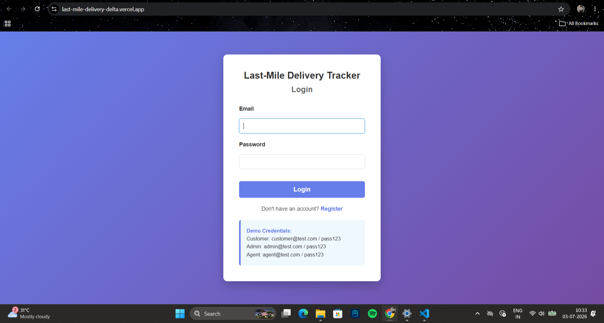
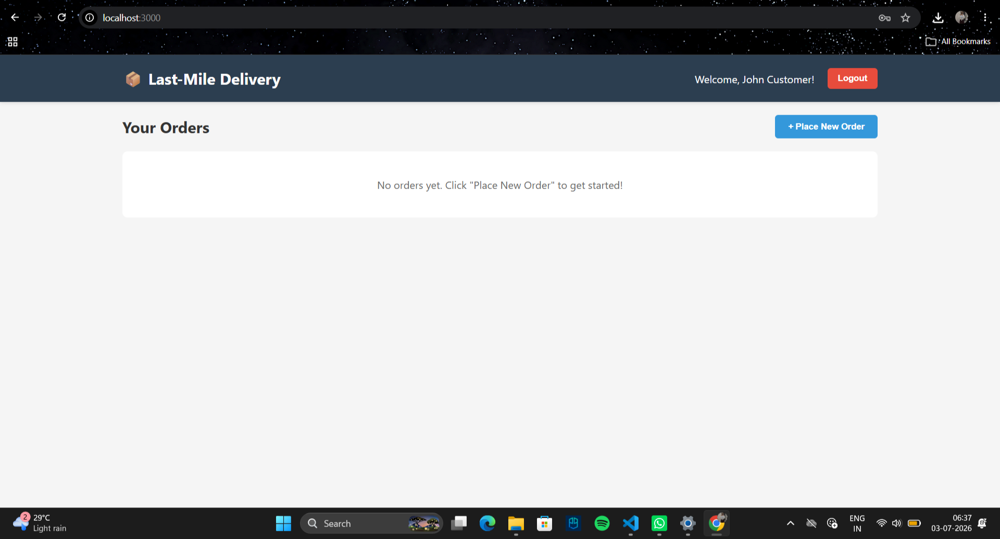
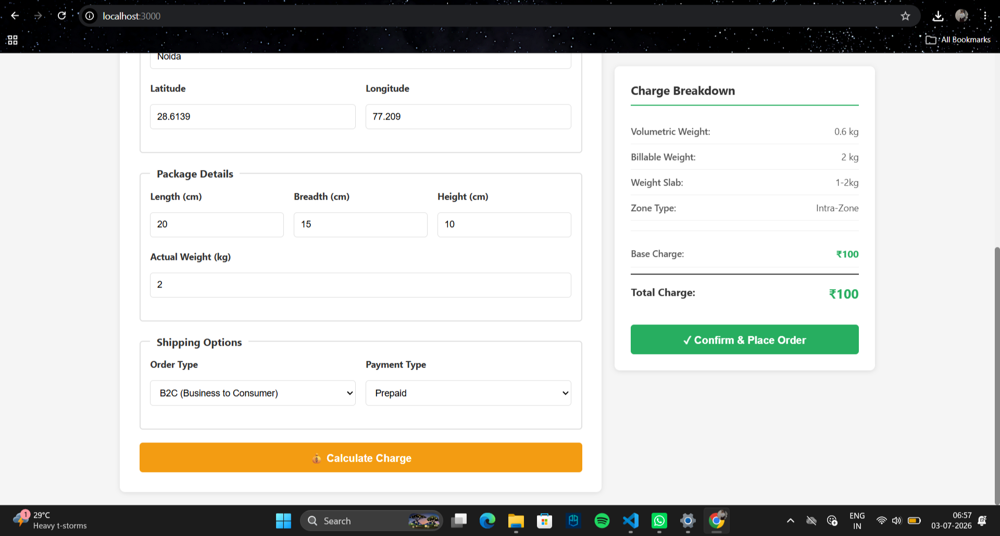
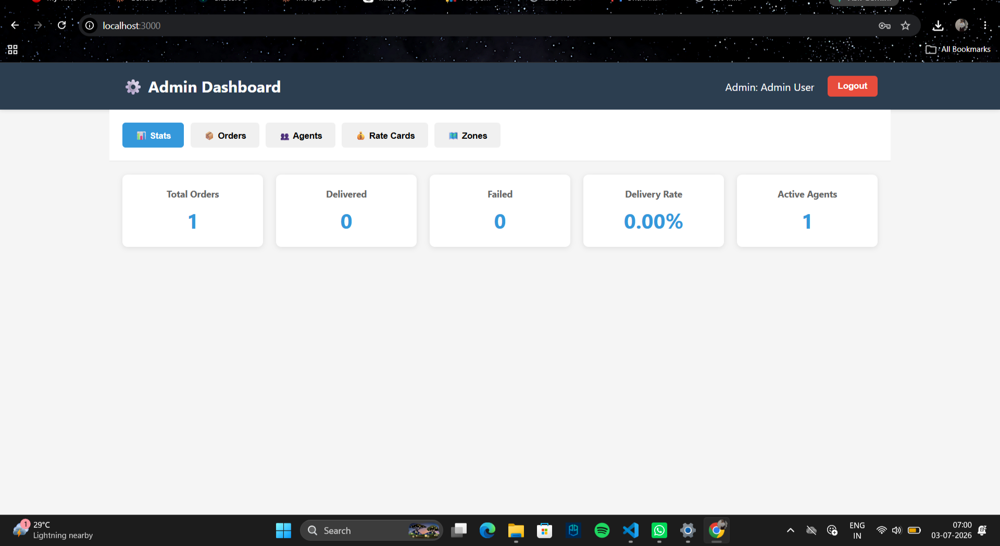
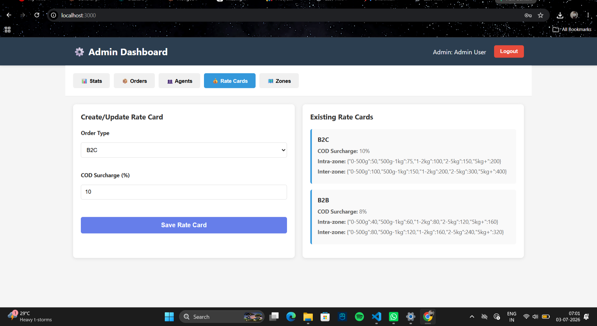

# 📦 Last-Mile Delivery Tracker


A full-stack delivery management platform where customers and admins create
orders with auto-calculated shipping charges, delivery agents are assigned
to fulfil them, and customers get real-time status tracking with email
notifications at every step.

The goal of this project is to simulate a production-ready last-mile
delivery management system featuring configurable pricing, zone-based
logistics, intelligent agent assignment, and real-time delivery tracking.

Built as part of the Unthinkable Solutions (Daffodil Software) assignment —
2027 batch.

---

## 🔗 Live Demo

| | |
|---|---|
| **Frontend** | [last-mile-delivery-delta.vercel.app](https://last-mile-delivery-delta.vercel.app) |
| **Backend API** | [last-mile-delivery-api.onrender.com](https://last-mile-delivery-api.onrender.com) |

> ⚠ **Backend is hosted on Render's free tier.**
> If the application appears to load slowly, please wait approximately
> 30–60 seconds for the backend service to wake up before retrying.
> Screenshots below cover the core flows in case of a slow cold start
> during review.

### 🔑 Demo Login

| Role     | Email                 | Password    |
|----------|------------------------|-------------|
| Admin    | admin@example.com      | password123 |
| Customer | customer@example.com   | password123 |
| Agent    | agent@example.com      | password123 |

*(Full table repeated further down for convenience.)*

---

## 📸 Screenshots

### Login

Secure role-based authentication with demo credentials for Customer, Admin, and Delivery Agent.

---

### Customer Dashboard

Customers can place new orders, track deliveries, and view their order history.

---

### Charge Calculation

Shipping charges are calculated automatically based on zones, volumetric weight, weight slab, order type, and payment method before confirming the order.

---

### Admin Dashboard

Admins can monitor platform statistics, manage orders, delivery agents, rate cards, and delivery zones.

---

### Rate Card Management

Admins can create and update B2B/B2C pricing and COD surcharge percentages without modifying application code.

---

## ✨ Features

- **Role-based access** — customer, delivery agent, and admin, each with a
  dedicated dashboard
- **Auto-calculated charges** — zone detection, volumetric weight, B2B/B2C
  rate cards, and COD surcharge, all computed before order confirmation
- **Admin-configurable pricing and zones** — no hardcoded rates or zone
  boundaries; both are fully manageable through the Admin Dashboard
- **Agent auto-assignment** — nearest available agent selected automatically,
  with manual override always available to admins
- **Immutable order tracking history** — every status change is logged with
  a timestamp and the actor who made it
- **Failed delivery recovery** — customer is notified, can reschedule, and
  the order is automatically reassigned for the new attempt
- **Email notifications** on every order status change

---

## 🛠 Tech Stack

- **Frontend:** React (Vite)
- **Backend:** Node.js, Express
- **Database:** MongoDB (Atlas)
- **Auth:** Role-based authentication (JWT)
- **Notifications:** Email on order status change
- **Deployment:** Vercel (frontend) · Render (backend)

### Deployment Architecture

```text
React (Vercel)
        │
        ▼
Express API (Render)
        │
        ▼
MongoDB Atlas
```

---

## 📂 Project Structure

```text
last-mile-delivery/
│
├── frontend/
│   ├── src/
│   ├── components/
│   ├── pages/
│   └── services/
│
├── backend/
│   ├── routes/
│   ├── middleware/
│   ├── utils/
│   ├── models/
│   ├── db.js
│   └── server.js
│
├── screenshots/
├── README.md
└── SYSTEM_DESIGN.md
```

---

## 🚀 Setup Guide

### Prerequisites
- Node.js v18+
- A MongoDB Atlas cluster (or local MongoDB instance)

### Backend

```bash
cd backend
npm install
cp .env.example .env
# fill in MONGODB_URI and any other required values in .env
node init-db.js        # seeds demo users, zones, and rate cards
npm start               # starts the API server on http://localhost:5000
```

### Frontend

```bash
cd frontend
npm install
npm run dev              # starts the app on http://localhost:3000
```

---

## 🔑 Demo Credentials

| Role     | Email                  | Password    |
|----------|-------------------------|-------------|
| Customer | customer@example.com   | password123 |
| Admin    | admin@example.com      | password123 |
| Agent    | agent@example.com      | password123 |

### Seeded Data

The database is pre-seeded with:

- 3 demo users
- 6 delivery zones
- Default rate cards
- Sample delivery agent
- Sample order

This allows the application to be tested immediately after deployment.

---

## 🌍 Environment Variables

Copy `.env.example` to `.env` and fill in the values. At minimum:

```env
PORT=5000

MONGODB_URI=

JWT_SECRET=

EMAIL_USER=

EMAIL_PASS=

CLIENT_URL=http://localhost:3000
```

---

## 🗄 Database Schema

### `users`
```js
{
  _id: ObjectId,
  email: String (unique),
  password: String (bcrypt hash),
  name: String,
  role: 'customer' | 'admin' | 'agent',
  createdAt: Date
}
```

### `zones`
```js
{
  _id: ObjectId,
  name: String,
  pincodes: [String],        // areas served by this zone
  coordinates: {              // bounding box used for zone detection
    minLat: Number,
    maxLat: Number,
    minLng: Number,
    maxLng: Number
  },
  createdAt: Date
}
```
Zones are fully admin-configurable via the Admin Dashboard — new zones (with
their own pincodes and coordinate bounds) can be created without any code
change or redeployment.

### `rateCards`
```js
{
  _id: ObjectId,
  type: 'B2C' | 'B2B',
  rates: {
    intraZone: { '0-500g': Number, '500g-1kg': Number, '1-2kg': Number, '2-5kg': Number, '5kg+': Number },
    interZone: { '0-500g': Number, '500g-1kg': Number, '1-2kg': Number, '2-5kg': Number, '5kg+': Number }
  },
  codSurcharge: Number,   // percentage
  createdAt: Date
}
```
Rate cards are also fully admin-configurable through the dashboard.

### `orders`
```js
{
  _id: ObjectId,
  customerId: ObjectId,
  agentId: ObjectId | null,
  pickupAddress: String,
  pickupCoordinates: { lat: Number, lng: Number },
  dropAddress: String,
  dropCoordinates: { lat: Number, lng: Number },
  length: Number, breadth: Number, height: Number,   // cm
  actualWeight: Number,                               // kg
  orderType: 'B2C' | 'B2B',
  paymentType: 'Prepaid' | 'COD',
  charge: {
    volumetricWeight: Number,
    billableWeight: Number,
    weightSlab: String,
    baseCharge: Number,
    codSurcharge: Number,
    total: Number
  },
  status: 'Created' | 'Picked Up' | 'In Transit' | 'Out for Delivery' | 'Delivered' | 'Failed',
  statusHistory: [
    { status: String, timestamp: Date, actor: String }
  ],
  createdAt: Date
}
```

---

## 📡 API Reference (high level)

> Confirm exact paths against `routes/auth.js`, `routes/orders.js`,
> `routes/admin.js` before final submission.

**Auth**
- `POST /api/auth/register` — customer registration
- `POST /api/auth/login` — returns auth token + role

**Orders**
- `POST /api/orders/calculate-charge` — returns charge breakdown before confirmation
- `POST /api/orders` — creates an order
- `GET /api/orders` — customer's own orders / admin: all orders
- `PATCH /api/orders/:id/status` — update order status (agent/admin)

**Admin**
- `GET/POST /api/admin/zones` — list / create zones
- `GET/POST /api/admin/rateCards` — list / create rate cards
- `GET /api/admin/agents` — list delivery agents
- `GET /api/admin/stats` — dashboard summary stats

---

## 💰 Rate Calculation Logic

1. **Zone detection** — pickup and drop coordinates are matched against each
   zone's bounding box. Zones are designed to tile the covered region with
   no gaps, so any valid coordinate resolves to exactly one zone.
2. **Volumetric weight** — `(length × breadth × height) / 5000`
3. **Billable weight** — the higher of actual weight vs volumetric weight
4. **Weight slab lookup** — billable weight maps to a slab
   (`0-500g`, `500g-1kg`, `1-2kg`, `2-5kg`, `5kg+`)
5. **Rate card lookup** — correct rate card (B2B/B2C) is fetched; whether
   pickup and drop share a zone determines intra-zone vs inter-zone pricing
6. **COD surcharge** — added as a percentage of base charge if payment type
   is COD
7. The full breakdown is returned to the customer for review **before**
   order confirmation.

All rates, surcharges, and zone boundaries are stored in MongoDB and managed
through the Admin Dashboard — nothing is hardcoded in application logic.

📄 Full design rationale (zone detection, auto-assignment, failed delivery
handling) is in [`SYSTEM_DESIGN.md`](./SYSTEM_DESIGN.md).

---

## 🧪 Example Data for Testing

This demo is scoped to a limited set of zones — **NCR (Delhi North/South/West,
Gurgaon, Noida) plus Kanpur**. Coordinates outside these zones will correctly
return "zone not found," since zone coverage is intentionally limited for
this MVP (new zones can be added anytime via the Admin Dashboard without
code changes).

| Zone         | Latitude | Longitude |
|--------------|----------|-----------|
| Delhi North  | 28.70    | 77.10     |
| Delhi South  | 28.55    | 77.15     |
| Delhi West   | 28.70    | 76.95     |
| Gurgaon      | 28.45    | 77.00     |
| Noida        | 28.55    | 77.35     |
| Kanpur       | 26.45    | 80.33     |

Sample package for testing: Length `20cm`, Breadth `15cm`, Height `10cm`,
Actual Weight `2kg` → resolves to weight slab `1-2kg`.

---

## ⚖️ Known Limitations / Future Work

- Zone coverage limited to NCR + Kanpur for this MVP; extending to any
  Indian city just requires adding a zone via the Admin Dashboard
- Agent-to-order distance uses straight-line (haversine) calculation rather
  than real road-network routing
- Notifications are email-only; SMS integration is a natural next step
- Free-tier hosting (Render) has a cold-start delay after inactivity

---

## 📝 Assignment Submission

This project was developed for the Unthinkable Solutions (Daffodil Software)
Software Engineering Assignment (2027 Batch).

Submission includes:
- ✅ Public GitHub repository
- ✅ Hosted frontend (Vercel)
- ✅ Hosted backend (Render)
- ✅ README with setup guide
- ✅ System design document
- ✅ Demo credentials

---

## License

MIT — developed as part of the Unthinkable Solutions (Daffodil Software)
Software Engineering Assignment (2027 Batch).

---

## 👤 Author

Priya Singh
